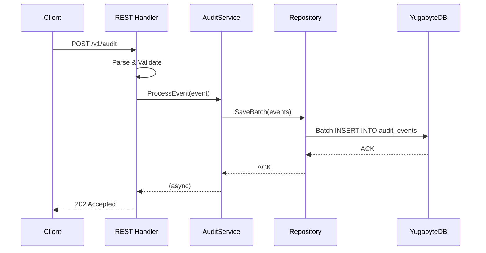

## Detailed Low-Level Design (LLD) for Audit Logging Service

This LLD describes the implementation in **Go (Fiber + gRPC)**, **YugabyteDB**, **MinIO**, **Redis Streams (optional)**, and **Kubernetes**.

---

### 1. Package / Module Structure

```
audit-service/
├── cmd/
│   └── main.go             # application startup
├── api/
│   ├── rest/
│   │   ├── router.go       # Fiber routes
│   │   └── handler.go      # HTTP handlers
│   └── grpc/
│       ├── server.go       # gRPC server init
│       └── service.proto   # Protobuf definitions
├── internal/
│   ├── validation/
│   │   └── validator.go    # request schema validation
│   ├── handler/
│   │   └── audit.go        # core business logic
│   ├── persistence/
│   │   ├── db.go           # YugabyteDB connection
│   │   └── repository.go   # CRUD & batch insert logic
│   ├── archival/
│   │   ├── scheduler.go    # backup cron job
│   │   └── minio_client.go # MinIO interactions
│   ├── broker/
│   │   └── redis_client.go # Redis Streams client
│   └── utils/
│       ├── idgen.go        # UUIDv7/KSUID generation
│       └── tracing.go      # OpenTelemetry setup
├── pkg/models/
│   ├── audit_event.go      # Go struct for AuditEvent
│   └── errors.go           # custom error types
├── configs/
│   └── config.yaml         # environment-specific configs
├── scripts/
│   └── migrate.sql         # DB migrations
├── tests/
│   ├── handler_test.go     # unit tests
│   └── repository_test.go
├── Dockerfile
└── helm/
    └── audit-service/
        ├── Chart.yaml
        ├── values.yaml
        └── templates/
            ├── deployment.yaml
            ├── service.yaml
            └── cronjob.yaml
```

---

### 2. API Definitions

#### 2.1 REST (Fiber)

```go
// router.go
func RegisterRoutes(app *fiber.App, h *handler.AuditHandler) {
    api := app.Group("/v1")
    api.Post("/audit", h.HandleAudit)
}

// handler.go
func (h *AuditHandler) HandleAudit(c *fiber.Ctx) error {
    var req models.AuditEvent
    if err := c.BodyParser(&req); err != nil {
        return c.Status(400).JSON(models.ErrorResponse{Message: "invalid JSON"})
    }
    if err := validation.ValidateAuditEvent(&req); err != nil {
        return c.Status(400).JSON(models.ErrorResponse{Message: err.Error()})
    }

    // Enrich and dispatch
    req.ID        = idgen.NewUUID()
    req.Timestamp = time.Now().UTC()
    go h.Service.ProcessEvent(req)  // async

    return c.SendStatus(202)
}
```

#### 2.2 gRPC

```proto
syntax = "proto3";
package audit;

import "google/protobuf/timestamp.proto";

service AuditService {
  rpc LogEvent(AuditEvent) returns (LogResponse);
}

message AuditEvent {
  string id             = 1;
  string service_name   = 2;
  string operation      = 3;
  string user_id        = 4;
  string resource_type  = 5;
  string resource_id    = 6;
  google.protobuf.Timestamp timestamp = 7;
  string trace_id       = 8;
  string span_id        = 9;
  string before         = 10;
  string after          = 11;
  string metadata       = 12;
}

message LogResponse {
  bool accepted = 1;
}
```

```go
// server.go
srv := grpc.NewServer()
auditevent.RegisterAuditServiceServer(srv, &AuditGRPCServer{service: auditService})
```

---

### 3. Sequence Diagram: Event Flow



---

### 4. Persistence Layer

#### 4.1 DB Connection

```go
// db.go
func NewDB(cfg Config) (*sql.DB, error) {
    connStr := fmt.Sprintf(
      "postgresql://%s:%s@%s:%d/%s?sslmode=disable",
      cfg.User, cfg.Password, cfg.Host, cfg.Port, cfg.Database,
    )
    return sql.Open("pgx", connStr)
}
```

#### 4.2 Repository & Batch Insert

```go
// repository.go
func (r *Repo) SaveBatch(ctx context.Context, events []models.AuditEvent) error {
    tx, err := r.db.BeginTx(ctx, nil)
    if err != nil { return err }

    stmt, err := tx.PrepareContext(ctx, `
      INSERT INTO audit_events_by_service_date
      (id, timestamp, service_name, operation, user_id, resource_type, resource_id, before, after, metadata, trace_id, span_id)
      VALUES ($1,$2,$3,$4,$5,$6,$7,$8,$9,$10,$11,$12)`)
    if err != nil {
      tx.Rollback()
      return err
    }

    for _, e := range events {
      if _, err := stmt.ExecContext(ctx,
        e.ID, e.Timestamp, e.ServiceName, e.Operation, e.UserID,
        e.ResourceType, e.ResourceID, e.Before, e.After, e.Metadata,
        e.TraceID, e.SpanID,
      ); err != nil {
        tx.Rollback()
        return err
      }
    }

    return tx.Commit()
}
```

- **Batch Size:** configurable (e.g. 500)
- **Retry Logic:** exponential backoff (3 retries)

---

### 5. Archival Component

#### 5.1 Scheduler (K8s CronJob)

```go
// scheduler.go
func StartBackupScheduler(cfg Config, repo *Repo, mc *minio.Client) {
    ticker := time.NewTicker(cfg.Archival.Interval)
    for range ticker.C {
        archiveOlderThan(cfg.Archival.Retention, repo, mc)
    }
}
```

#### 5.2 Backup Logic

```go
// scheduler.go
func archiveOlderThan(retentionDays int, repo *Repo, mc *minio.Client) {
    events, _ := repo.FetchOlderThan(retentionDays)
    if len(events) == 0 {
        return
    }
    data, _ := json.Marshal(events)
    key := fmt.Sprintf("%s/%s.json.gz", events[0].ServiceName, time.Now().Format("2006-01-02"))
    reader := compressGZIP(bytes.NewReader(data))
    _, err := mc.PutObject(
      context.Background(), "audit-backup", key, reader, reader.Size(),
      minio.PutObjectOptions{ContentType: "application/json"},
    )
    if err != nil {
      log.Error().Err(err).Msg("MinIO archival failed")
      return
    }
    repo.DeleteOlderThan(retentionDays)
}
```

---

### 6. Redis Streams (Optional)

```go
// redis_client.go
func NewRedisClient(cfg Config) *redis.Client { ... }

func (b *Broker) Publish(ctx context.Context, event models.AuditEvent) error {
    payload, _ := json.Marshal(event)
    return b.redis.XAdd(&redis.XAddArgs{
      Stream: cfg.StreamName,
      Values: map[string]interface{}{"data": payload},
    }).Err()
}

func (b *Broker) Consume(ctx context.Context, handler func(models.AuditEvent)) {
    for {
        streams, _ := b.redis.XReadGroup(&redis.XReadGroupArgs{
          Group:    cfg.Group,
          Consumer: cfg.ConsumerName,
          Streams:  []string{cfg.StreamName, ">"},
          Count:    cfg.BatchSize,
          Block:    cfg.BlockTime,
        }).Result()

        for _, msg := range streams {
            var e models.AuditEvent
            json.Unmarshal([]byte(msg.Values["data"].(string)), &e)
            handler(e)
            b.redis.XAck(cfg.StreamName, cfg.Group, msg.ID)
        }
    }
}
```

---

### 7. Configuration (config.yaml)

```yaml
server:
  port: 8080

database:
  host: yugadb.local
  port: 5433
  user: audit
  password: secret
  database: auditdb

archival:
  interval: 24h
  retention: 7 # days

minio:
  endpoint: minio.local:9000
  bucket: audit-backup
  accessKey: minioadmin
  secretKey: minioadmin

redis:
  enabled: false
  address: redis.local:6379
  streamName: audit-stream
  group: audit-workers
  consumerName: worker-1
  batchSize: 100
  blockTime: 5s
```

---

### 8. Kubernetes Manifests (Helm)

#### 8.1 Deployment (templates/deployment.yaml)

```yaml
apiVersion: apps/v1
kind: Deployment
metadata:
  name: {{ .Chart.Name }}
spec:
  replicas: {{ .Values.replicaCount }}
  template:
    spec:
      containers:
        - name: audit-service
          image: "{{ .Values.image.repository }}:{{ .Values.image.tag }}"
          ports:
            - containerPort: 8080
          envFrom:
            - configMapRef:
                name: {{ .Release.Name }}-config
          livenessProbe:
            httpGet:
              path: /health
              port: 8080
          readinessProbe:
            httpGet:
              path: /health
              port: 8080
```

#### 8.2 CronJob (templates/cronjob.yaml)

```yaml
apiVersion: batch/v1
kind: CronJob
metadata:
  name: {{ .Chart.Name }}-archival
spec:
  schedule: "0 2 * * *"
  jobTemplate:
    spec:
      template:
        spec:
          containers:
            - name: archival
              image: "{{ .Values.image.repository }}:{{ .Values.image.tag }}"
              command: ["/bin/audit-service", "--run-archival"]
          restartPolicy: OnFailure
```

---

### 9. Observability & Metrics

- **Prometheus**: expose `/metrics` via Fiber middleware
- **Metrics to collect**:

  - `audit_events_processed_total`
  - `audit_events_failed_total`
  - `audit_persistence_latency_seconds`

- **OpenTelemetry**: instrument all handlers, DB calls, and Redis consumption
- **Example Alert Rules**:

  - `rate(audit_events_failed_total[5m]) > 0`
  - `histogram_quantile(0.95, sum(rate(audit_persistence_latency_seconds_bucket[5m])) by (le)) > 1`

---

### 10. Security

- **mTLS** for both REST and gRPC (via Envoy sidecar)
- **RBAC**: Kubernetes service accounts scoped to DB and MinIO access
- **Immutability**: no update/delete operations on audit records
- **WORM** mode on MinIO bucket for compliance

---

### 11. Error Handling & Retries

- **Persistence**: retry up to 3 times with exponential backoff (100 ms → 200 ms → 400 ms)
- **Archival**: log failures and retry on next scheduled run; emit alert if repeated failures
- **Redis Streams**: use `XPENDING` to detect stalled messages and reprocess

---

### 12. ID Generation

```go
// idgen.go
package utils

import (
  "github.com/google/uuid"
  "github.com/segmentio/ksuid"
)

// NewUUID returns a random UUID (v4).
func NewUUID() string {
  return uuid.New().String()
}

// NewTimeSortableID returns a KSUID, which is roughly sortable by generation time.
func NewTimeSortableID() string {
  return ksuid.New().String()
}
```
